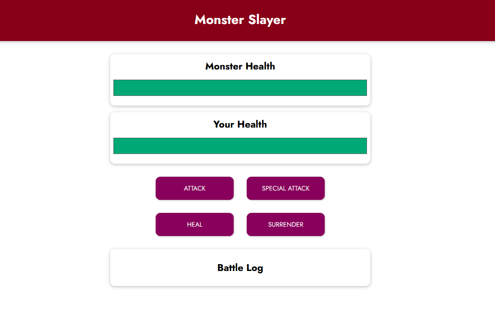
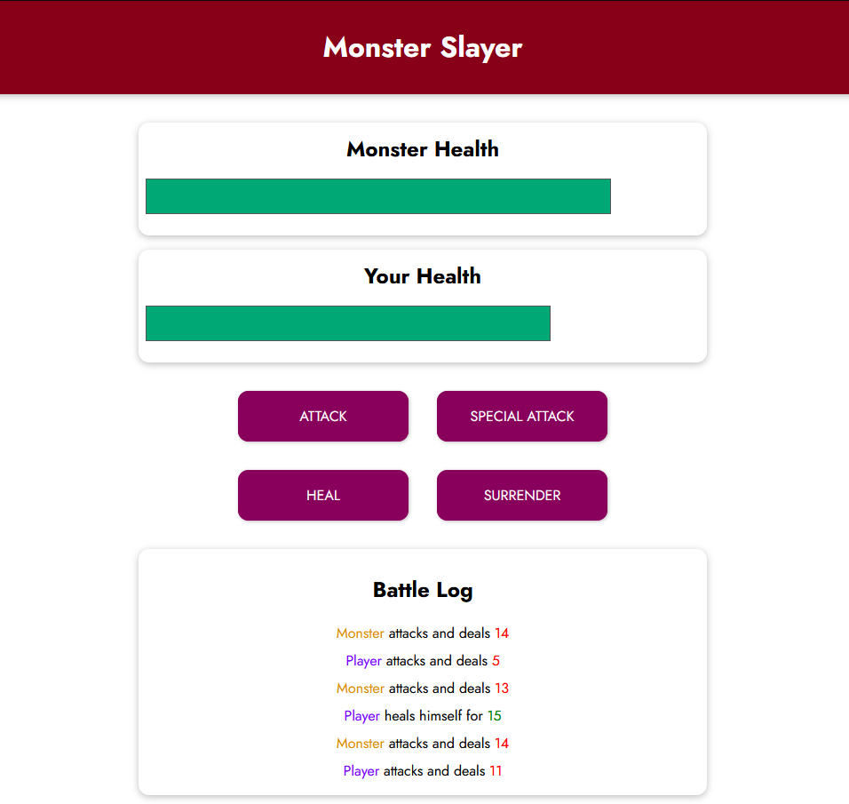

# Monster Slayer Game (Vue 3)

A simple turn-based fighting game built using **Vue.js 3** with the Composition API. In this game, the player faces off against a monster in a battle of attacks, special attacks, healing, and survival. The gameplay includes real-time health bars, action logging, and win/loss logic.

<p align="center">
  
  
</p>

---

## 🚀 Features

- 🎮 Player vs Monster turn-based combat
- 🩸 Dynamic health bars for both player and monster
- ⚔️ Special attack available every 3 rounds
- 🧪 Healing mechanism that restores HP (capped at 100)
- 🏳️ Surrender option
- 📜 Real-time battle log with visual styling

---

## 🧱 Tech Stack

- [Vue.js 3](https://vuejs.org/)
- Composition API
- HTML5 / CSS3
- Google Fonts

---

## 📁 Project Structure

```bash
├── index.html        # Main HTML file with Vue integration
├── app.js            # Vue 3 logic and methods
├── styles.css        # Styling for layout, health bars, buttons, etc.
└── assets/           # Game images
```

---

## 🔧 How It Works

### Game Flow

1. Click **ATTACK** to deal 5–12 damage to the monster.
2. The monster will counter-attack dealing 8–15 damage.
3. Every 3rd round, **SPECIAL ATTACK** (10–25 damage) becomes available.
4. You can **HEAL** for 8–20 HP, capped at 100, but the monster attacks right after.
5. **SURRENDER** ends the game and declares the monster as the winner.
6. Once health drops to 0 for either side, the game ends with the proper result (Win / Lose / Draw).
7. All actions are logged in the **Battle Log** with clear visual distinction.

### Health Bar Styling

- Dynamic width reflects real-time health status.
- Health never goes below 0% visually.

---

## 🧠 Key Vue Concepts Used

- `data()`: To manage reactive state for health, round count, winner, etc.
- `methods`: Game mechanics like attack, heal, special attack, and log updates.
- `computed`: For dynamic styling of health bars and checking if special attack is available.
- `watch`: To detect health changes and determine the game winner.
- `v-if`, `v-else`, `v-for`, `:class`, `@click`, `:disabled` for conditional rendering and event binding.

---

## 🛠️ Setup & Run

1. **Clone the repository**:

   ```bash
   git clone https://github.com/your-username/monster-slayer.git
   cd monster-slayer
   ```

2. **Open `index.html` in your browser** (no build tools needed).

✅ No additional setup or dependencies required — it's all vanilla HTML + Vue via CDN.

---

## 📜 License

MIT License. Free to use and modify for learning and personal projects.

---

## 👨‍💻 Developer

**Fernando Futila**  
[GitHub](https://github.com/Futila) • [LinkedIn](https://www.linkedin.com/in/fernando-futila/)
